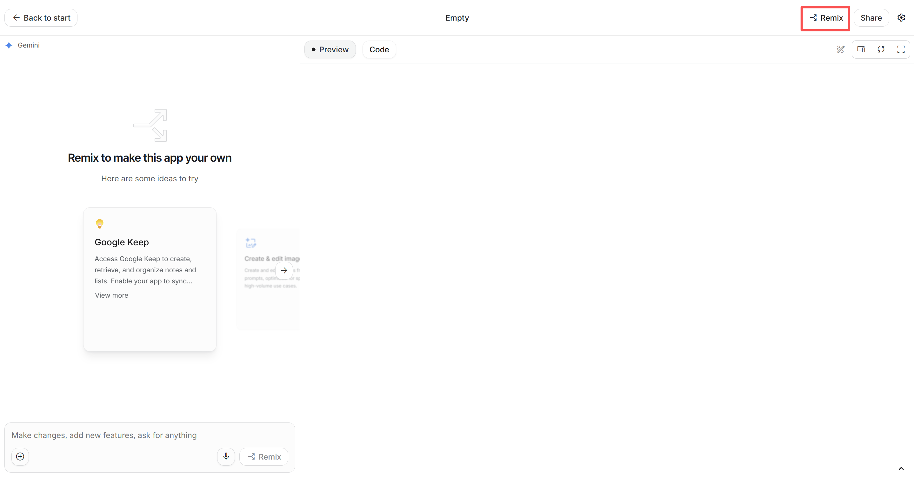
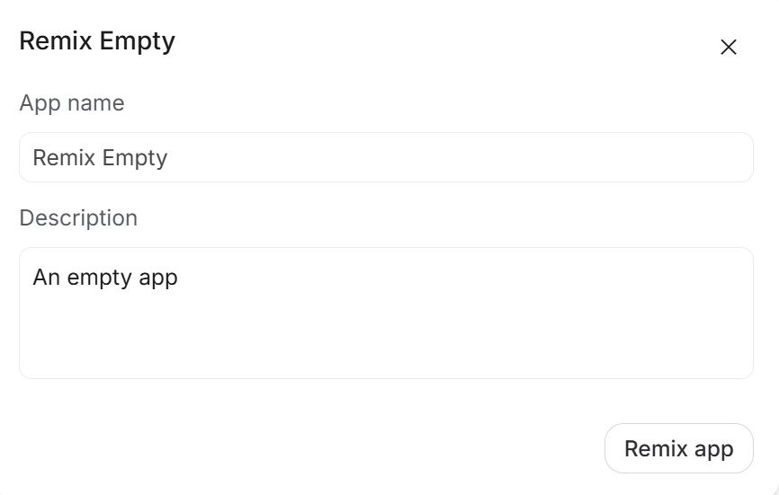
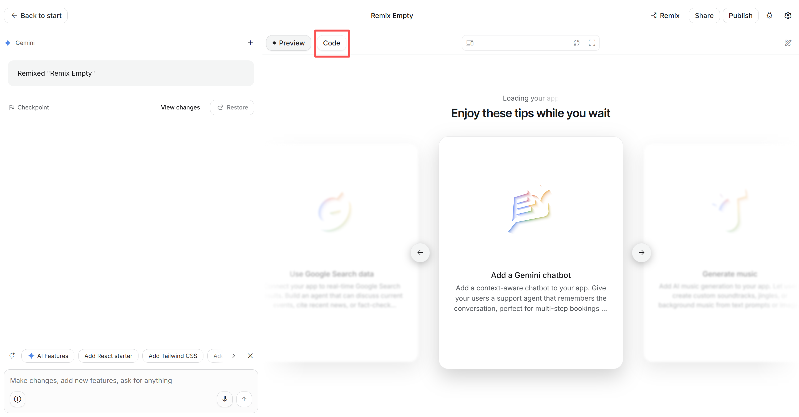
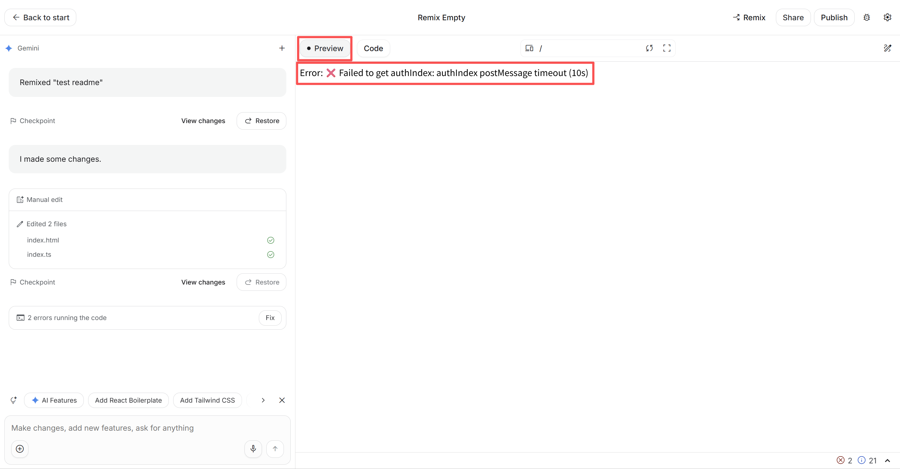
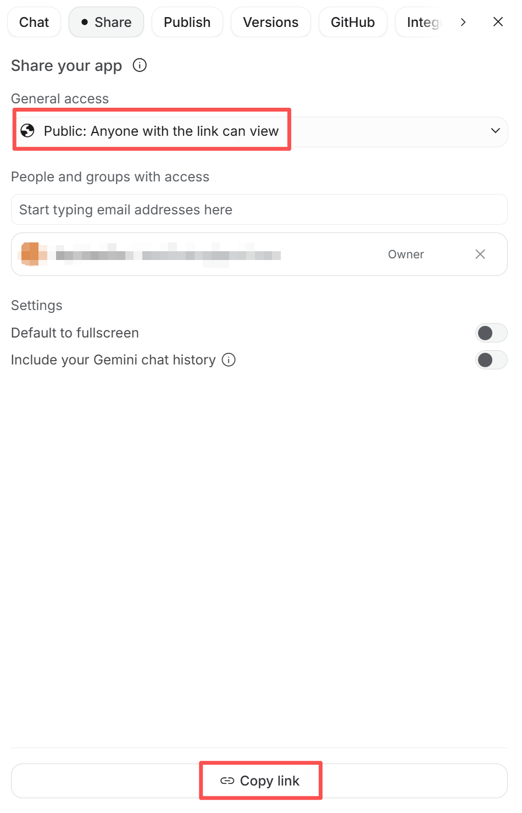

# 新建 AI Studio App 教程

本教程用于创建项目专用的 AI Studio App，并获取 `AI_STUDIO_APP_URL` 环境变量所需的应用链接。

## 1. 打开空白 App

登录 Google 账号后，访问 [AI Studio 空白 App](https://aistudio.google.com/apps/bundled/blank)。

页面打开后，点击右上角的 **Remix**。不要点击左下角输入框旁的 Remix 按钮。



## 2. 创建自己的副本

在弹窗中修改 **App name**，也可以按需修改 **Description**，然后点击右下角的 **Remix app**。



等待应用副本创建完成。顶部出现你设置的应用名称后，点击预览区上方的 **Code**，进入代码编辑器。



## 3. 替换代码文件

在代码编辑器中依次替换以下文件的全部内容：

1. 打开 AI Studio App 中的 `index.ts`，删除原有内容，然后复制本项目 [`scripts/client/build.js`](../../scripts/client/build.js) 的全部内容并粘贴进去。
2. 打开 AI Studio App 中的 `index.html`，删除原有内容，然后复制本项目 [`scripts/client/index.html`](../../scripts/client/index.html) 的全部内容并粘贴进去。

完成后，点击编辑器下方的 **Save**；也可以按 `Ctrl+S`（macOS 使用 `Command+S`）保存。

> 请直接复制当前版本仓库中的文件。项目升级且这两个文件发生变化后，需要回到 App 中重新替换并保存。

## 4. 检查预览

点击预览区上方的 **Preview**，等待大约 10 秒。如果出现以下错误，说明客户端代码已经正常运行并正在等待本项目建立连接，这是预期现象：

```text
Error: ❌ Failed to get authIndex: authIndex postMessage timeout (10s)
```



AI Studio 左侧或底部可能同时显示代码错误数量。不要点击 **Fix** 让 AI 自动改写代码；只要预览出现上面的 `authIndex postMessage timeout (10s)` 即可继续。

## 5. 公开分享并复制链接

1. 点击页面右上角的 **Share**，无需点击 **Publish**。
2. 在 **General access** 中选择 **Public: Anyone with the link can view**。
3. 点击分享面板底部的 **Copy link**。



复制到的链接应类似：

```text
https://ai.studio/apps/xxxxxxxx-xxxx-xxxx-xxxx-xxxxxxxxxxxx
```

## 6. 配置环境变量

将完整链接写入项目根目录的 `.env`：

```env
AI_STUDIO_APP_URL=https://ai.studio/apps/xxxxxxxx-xxxx-xxxx-xxxx-xxxxxxxxxxxx
```

保存 `.env` 后重启 AIStudioToAPI。启动日志中的 `AI Studio App URL` 应显示你刚配置的地址。

> 该 App 必须保持 Public；否则运行 AIStudioToAPI 的 Google 账号可能无法打开它。公开链接也意味着任何获得链接的人都可以查看 App，请不要在 `index.ts` 或 `index.html` 中加入密钥、Cookie 或其他敏感信息。
